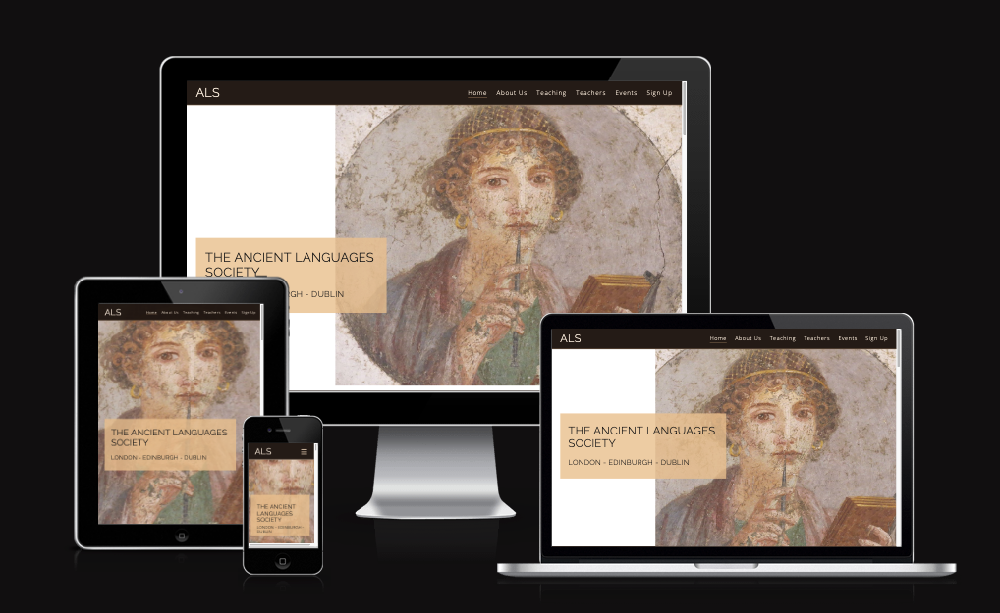
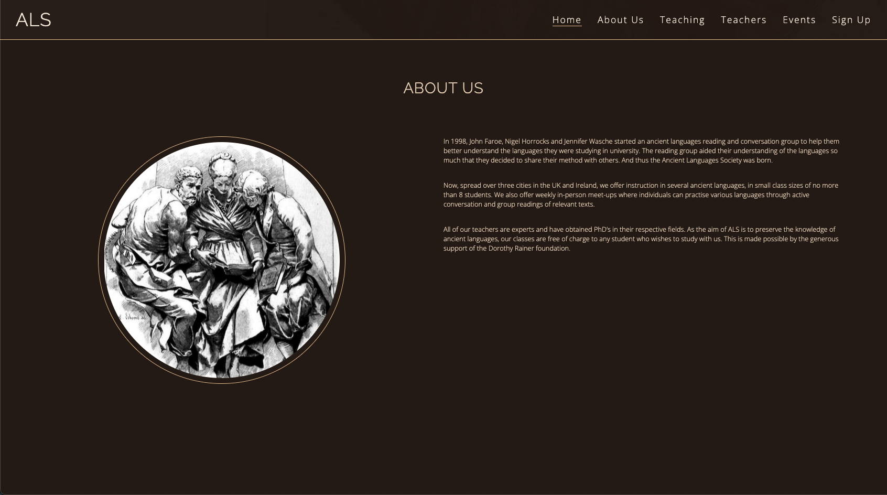
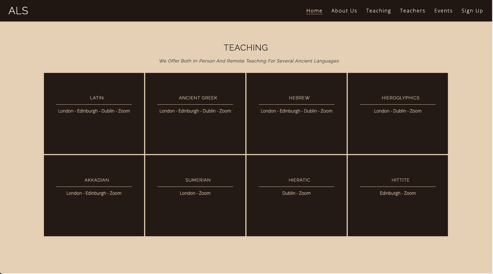
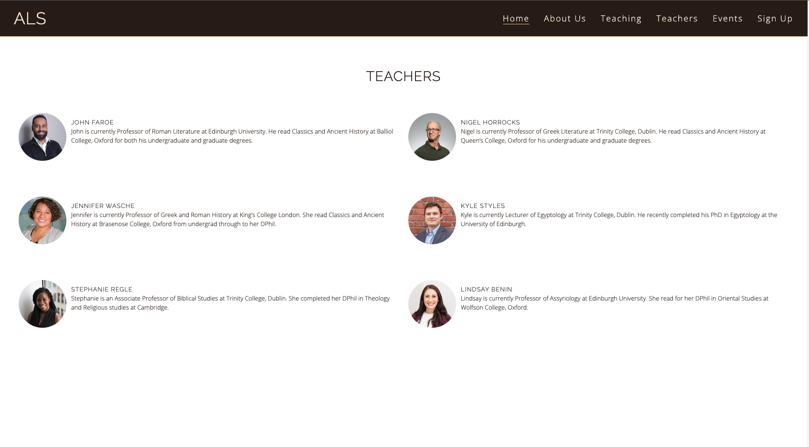
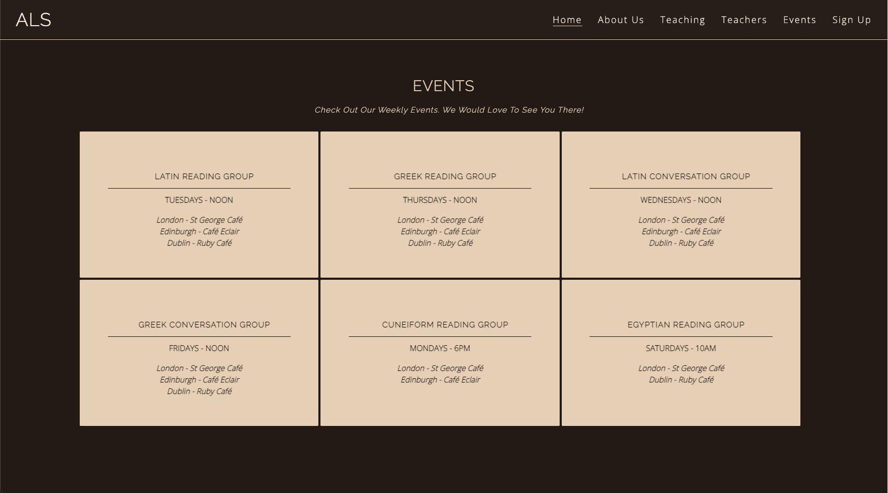
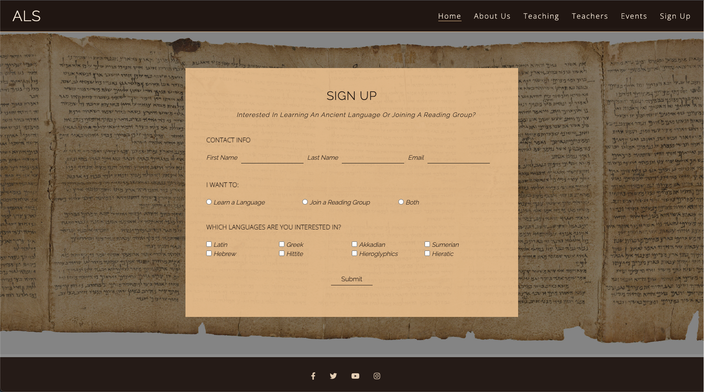

# The Ancient Languages Society

Welcome to the Ancient Language Society. This is a website created for the HTML and CSS Essentials Portfolio Project with [Code Institute](https://codeinstitute.net). The Ancient Languages Society and all of the mentioned individuals and establishments on the website are fictional and were created for the purpose of the Code Institute Project.

You can view the website [here](https://adamsburge.github.io/Ancient-Languages-Society/).

The website is mobile responsive, as can be seen in the image below.

# Features

The website is a single-page site with a menu that takes the user to different sections of the page. There are six total sections: Home (or landing section), About Us, Teaching, Teachers, Events, and a Signup Form. Each section is designed to take up the entire view height of the screen on desktops. This feature is removed on mobile formats.

## Home Section

- The home/landing section provides a simple title page layout with the name of the society, the locations it operates in, and an image of a fresco from Pompeii.
  

## About Us Section

- The About Us section provides a brief history of the society and how it began and sets it beside (or under on mobile) an old sketch of a group of people reading together (a fitting image since the society hosts reading groups).
  

## Teaching Section

- The teaching section provides the user with information regarding which languages the society is able to teach and which cities they are offered in. 
  

## Teachers Section

- The teaching section provides profile pictures, names, and short biographies of the different teachers associated with the society.
  

## Events Section

- The events section provides the reader with information regarding weekly events the society puts on as well as where and when the events occur.
  

## Signup Section

- The signup section provides the form for the user to fill out if they wish to get involved either in a language class or a reading group.
  

# Testing

## Bugs

- One unsolved bug is that the mobile hamburger drop-down menu has to be manually closed. This, however, is due to the fact that I decided not to use Javascript as this project is focused on HTML and CSS. I intentionally tried to find a way to create the mobile menu without using Javascript and this is the one bug. This feature could be fixed in the future if I decide to incorporate Javascript.

## Validator Testing

- HTML - The HTML was tested with [the W3C HTML validator service](https://validator.w3.org)
    - The HTML did not have any errors, but the service did mention a few warnings. 
        - Warning 1: to only use H1 headings as top-level headings. Yet, as this is a single page site, the sections act as pages. Thus each section has a H1 Heading, but all other heading are H2 and below.
        - Warning 2: lists an empty heading. However, this heading is not empty, but contains a submit input and the heading is used to style the button.

- CSS - The CSS was tested with [the W3C CSS validator service](https://jigsaw.w3.org/css-validator/) and no errors were found.

- Accesibility (Lighthouse score):

# Deployment

- detail how the site is deployed (i.e., Github pages)

# Credits

## Content
- All the content on this site was written by myself. The Ancient Languages society and the individuals associated with the society are entirely fictitious and are solely for the purpose of the HTML and CSS Project with Code Institute.

## Media
- Image of Pompeian Woman Writing - <a href="https://www.flickr.com/people/41099823@N00">ho visto nina volare</a> from Italy, <a href="https://commons.wikimedia.org/wiki/File:Napoli,_museo_archeologico_(18536648405).jpg">Napoli, museo archeologico (18536648405)</a>, <a href="https://creativecommons.org/licenses/by-sa/2.0/legalcode" rel="license">CC BY-SA 2.0</a>
- Reading Group photo from About Us section - Photo by <a href="https://unsplash.com/@alexisrbrown?utm_source=unsplash&utm_medium=referral&utm_content=creditCopyText">Alexis Brown</a> on <a href="https://unsplash.com/s/photos/reading-group?utm_source=unsplash&utm_medium=referral&utm_content=creditCopyText">Unsplash</a>
- Teacher Profile Images
    - Photo by <a href="https://unsplash.com/@willsouzabr?utm_source=unsplash&utm_medium=referral&utm_content=creditCopyText">Willian Souza</a> on <a href="https://unsplash.com/s/photos/headshot?utm_source=unsplash&utm_medium=referral&utm_content=creditCopyText">Unsplash</a>
  - Photo by <a href="https://unsplash.com/@fotosushi?utm_source=unsplash&utm_medium=referral&utm_content=creditCopyText">Foto Sushi</a> on <a href="https://unsplash.com/s/photos/headshot?utm_source=unsplash&utm_medium=referral&utm_content=creditCopyText">Unsplash</a>
  - Photo by <a href="https://unsplash.com/@wocintechchat?utm_source=unsplash&utm_medium=referral&utm_content=creditCopyText">Christina @ wocintechchat.com</a> on <a href="https://unsplash.com/s/photos/headshot?utm_source=unsplash&utm_medium=referral&utm_content=creditCopyText">Unsplash</a>
  - Photo by <a href="https://unsplash.com/@ibidsy?utm_source=unsplash&utm_medium=referral&utm_content=creditCopyText">Clayton</a> on <a href="https://unsplash.com/s/photos/headshot?utm_source=unsplash&utm_medium=referral&utm_content=creditCopyText">Unsplash</a>
  - Photo by <a href="https://unsplash.com/@wocintechchat?utm_source=unsplash&utm_medium=referral&utm_content=creditCopyText">Christina @ wocintechchat.com</a> on <a href="https://unsplash.com/s/photos/headshot?utm_source=unsplash&utm_medium=referral&utm_content=creditCopyText">Unsplash</a>
  - Photo by <a href="https://unsplash.com/@ibidsy?utm_source=unsplash&utm_medium=referral&utm_content=creditCopyText">Clayton</a> on <a href="https://unsplash.com/s/photos/headshot?utm_source=unsplash&utm_medium=referral&utm_content=creditCopyText">Unsplash</a>
- Background image of Isaiah Scroll - Unknown author, <a href="https://commons.wikimedia.org/wiki/File:Isaiah_Scroll_2.jpg">Isaiah Scroll 2</a>, scale by Adam Burge, <a href="https://creativecommons.org/publicdomain/zero/1.0/legalcode" rel="license">CC0 1.0</a>
  
  
  

## Design and Aesthetic
- Inspiration taken from: 
    - [Awwwards](https://www.awwwards.com)
        - [Grotte des Demoiselles](https://www.demoiselles.com/fr)
        - [Piranesi Digital](https://piranesi.kunsthalle-karlsruhe.de/de)
        - [Pyramids of Meroë](https://artsexperiments.withgoogle.com/meroe/)
        - [IsOurEconomyFair.org](https://isoureconomyfair.org)
        - [Ivan Aivazovsky](http://ivanaivazovsky.life)
        - [Sage Culture](https://sageculture.com)
        - [Persepolis Reimagined](https://persepolis.getty.edu)
    - [Artefactuel](https://artefactuel.ca)
    - [AHRC Heritage Priority Area](https://heritage-research.org)
    - [Art & History Museum](https://www.artandhistory.museum)
- Font Combination:
    - Suggestion by Paul Rand in Lou Levit's article [The Ultimate Collection of Google Font Pairings (Displayed Beautifully with Classic Art)](https://heyreliable.com/ultimate-google-font-pairings/)
- For icons: [Fontawesome](https://fontawesome.com)

## Code
- [W3 Schools](https://www.w3schools.com) for guidance on various bits of code throughout 
- Several lines of code throughout were take and/or adapted from code in [my Love Running project](https://github.com/adamsburge/love-running-project) with [Code Institute](https://codeinstitute.net) which I coded along side videos from the course.
- Help with centering submit button on form from [Frits on Stack Overflow](https://stackoverflow.com/users/6049581/frits). Find the thread [here](https://stackoverflow.com/questions/45430798/how-do-you-horizontal-align-submit-button).
- Help creating the HTML and CSS only mobile menu hamburger drop-down: [Kevin Powell](https://www.youtube.com/kepowob) from [this video](https://www.youtube.com/watch?v=8QKOaTYvYUA) and [this codepen.io page](https://codepen.io/kevinpowell/pen/jxppmr)
- For code to display mobile menu in reverse (or correct) order: [Josh Crozier](https://stackoverflow.com/users/2680216/josh-crozier)'s code on [this Stack Overflow page](https://stackoverflow.com/questions/25695000/how-to-display-a-reverse-ordered-list-in-html)
- For media query standard dimensions: [Gokulkrishh](https://gist.github.com/gokulkrishh)'s page on [CSS Media Queries for Desktop, Tablet, Mobile](https://gist.github.com/gokulkrishh/242e68d1ee94ad05f488) was invaluable.
- For getting the signup form radio and checkbox buttons in columns, see [Danielle Peters](https://community.hubspot.com/t5/user/viewprofilepage/user-id/4505)' solution on [this page](https://community.hubspot.com/t5/Lead-Capture-Tools/Forms-multiple-columns-for-check-boxes/m-p/9531) and [this jsfiddle page](http://jsfiddle.net/pynhA/2/)

## Individuals
- My Mentor, Adegbenga Adeye - comments, feedback, advice
- My wife, Megan - comments, feedback and edits of website content