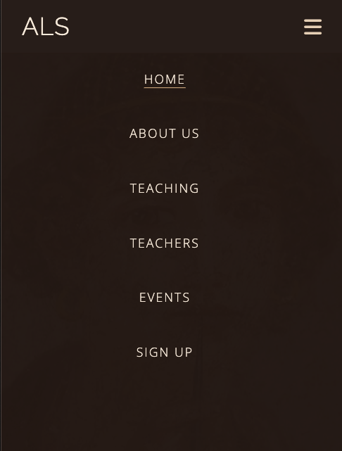
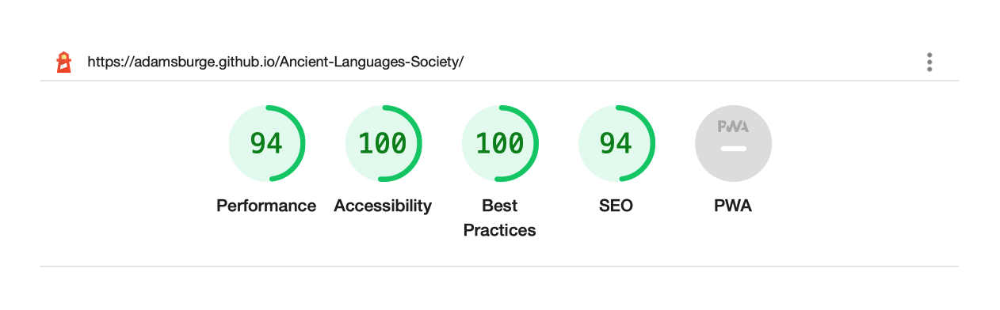

# The Ancient Languages Society

Welcome to the Ancient Language Society. The Ancient Languages Society website is a site to help interested users discover the Society and get involved. The Society seeks to preserve the knowledge of ancient languages by teaching these languages for free to any interested person and by providing weekly reading groups for those who already know the languages.

This is a website created for the HTML and CSS Essentials Portfolio Project with [Code Institute](https://codeinstitute.net). The Ancient Languages Society and all of the mentioned individuals and establishments on the website are fictional and were created for the purpose of the Code Institute Project.

You can view the website [here](https://adamsburge.github.io/Ancient-Languages-Society/).

The website is mobile responsive, as can be seen in the image below.

# Features

The website is a single-page site with a menu that takes the user to different sections of the page. There are seven total sections: Navigation, Home (or landing section), About Us, Teaching, Teachers, Events, and a Signup Form + Footer. Each section is designed to take up the entire view height of the screen on desktops. This feature is removed on mobile formats.

## Navigation 

- The Navigation bar is fixed to the top of the page.
- It contains the Logo (ALS) on the left and the menu navigation on the right. 

- When the website is viewed on a mobile phone, the menu navigation changes from the list of pages to a hamburger menu which, when pressed, opens up the menu navigation items in a full-screen display.
### Mobile Navigation Bar Unopened  

### Mobile Navigation Bar Opened  

## Home Section

- The home/landing section provides a simple title-page layout with the name of the society, the locations it operates in, and an image of a fresco from Pompeii.
  

## About Us Section

- The About Us section provides a brief history of the society and how it began and sets it beside (or under on mobile) an old sketch of a group of people reading together (a fitting image since the society hosts reading groups).
  

## Teaching Section

- The teaching section provides the user with information regarding which languages the society is able to teach and which cities each language is offered in. 
- The information is portrayed in a table-like format, with each cell containing the relevant information for a specific language.
  

## Teachers Section

- The teaching section provides profile pictures, names, and short biographies of the different teachers associated with the society. The biographies also list the credentials of each teacher to asure the user that the teachers are qualified to teach the languages offered by the society.
  

## Events Section

- The events section provides the reader with information regarding weekly events the society puts on as well as where and when the events occur.
- The information is portrayed in a table-like format, with each cell containing the relevant information for a specific weekly meetup.
  

## Signup Section + Footer

- The signup section provides the form for the user to fill out if they wish to get involved either in a language class or a reading group.
- The section contains a background image of an ancient Hebrew scroll.
- The form requests the user's first and last name, email address, reason for signing up and language interest. The form is designed to require entries in every field except language preference and to only accept a real email address format in the email address field. 

- The signup section also includes the website footer which contains only the social media links. 
- Th signup section has been intentionally sized so that the heading navigation + the signup section + the footer all equal the view height of the screen being used.

  

# Testing
- I have manually tested the website for desktop on Google Chrome, Microsoft Edge, Firefox, Safari, and Vivaldi. 
- I have manually tested the website for mobile responsiveness on an iPhone 7 and an iPhone 8 as well as using both devtools and [Screenfly](https://bluetree.ai/screenfly/) to test the website on various Apple and Android mobile and tablet devices from the iPhone 5 onward.
    - I can confirm that the website looks good on all the major desktop web browsers and all the most popular tablet and mobile devices. I can confirm that the website looks good on all screensizes.
- I can confirm also that the website navigation is easy to use and understand.
- I can confirm that the signup form works and the submit button works.

## Bugs
### Solved
- When I originally tested the signup form, the language interest option only showed up as 'on' in the data catalogue (which is Code Institute's form dump). After investigating the issue, I found that the checkboxes were missing the value attribute which would allow the data to represent the checkbox selected. After changing this, the form worked properly.

### Unsolved
- One unsolved bug is that the mobile hamburger drop-down menu has to be manually closed. This, however, is due to the fact that I decided not to use Javascript as this project is focused on HTML and CSS. I intentionally tried to find a way to create the mobile menu without using Javascript and this is the one bug. This feature could be fixed in the future if I decide to incorporate Javascript.

## Validator Testing

- HTML - The HTML was tested with [the W3C HTML validator service](https://validator.w3.org)
    - The HTML did not have any errors, but the service did mention a warning which is to only use H1 headings as top-level headings. Yet, as this is a single page site, the sections act as pages. Thus each section title is a H1 Heading, but all other headings are H2 and below.

- CSS - The CSS was tested with [the W3C CSS validator service](https://jigsaw.w3.org/css-validator/) and no errors were found.

- Accessibility: I have tested the webstie, fonts, and colors for accessibility with Lighthouse in Devtools. The accessibility score is 100.

# Deployment

- I have deployed the website through GitHub Pages. To do this, I:
    - navigated to the GitHub repository and selected settings
    - on the lefthand side, I selected the 'Pages' option from the menu navigation
    - Under 'Source', I selected the main branch
    - Then the live website link was provided

    The website can be accessed [here](https://adamsburge.github.io/Ancient-Languages-Society/).

# Credits

## Content
- All the content on this site was written by myself. The Ancient Languages society and the individuals associated with the society are entirely fictitious and are solely for the purpose of the HTML and CSS Project with Code Institute.

## Media
- Image of Pompeian Woman Writing - [ho visto nina volare](https://www.flickr.com/people/41099823@N00) from Italy, [Napoli, museo archeologico (18536648405)](https://commons.wikimedia.org/wiki/File:Napoli,_museo_archeologico_(18536648405).jpg), [CC BY-SA 2.0](https://creativecommons.org/licenses/by-sa/2.0/legalcode)
- Reading Group photo from About Us section - Photo by [Alexis Brown](https://unsplash.com/@alexisrbrown?utm_source=unsplash&utm_medium=referral&utm_content=creditCopyText) on [Unsplash](https://unsplash.com/s/photos/reading-group?utm_source=unsplash&utm_medium=referral&utm_content=creditCopyText)

- Teacher Profile Images
    - Photo by [Willian Souza](https://unsplash.com/@willsouzabr?utm_source=unsplash&utm_medium=referral&utm_content=creditCopyText) on [Unsplash](https://unsplash.com/s/photos/headshot?utm_source=unsplash&utm_medium=referral&utm_content=creditCopyText)
  - Photo by [Foto Sushi](https://unsplash.com/@fotosushi?utm_source=unsplash&utm_medium=referral&utm_content=creditCopyText) on [Unsplash](https://unsplash.com/s/photos/headshot?utm_source=unsplash&utm_medium=referral&utm_content=creditCopyText)
  - Photo by [Christina @ wocintechchat.com](https://unsplash.com/@wocintechchat?utm_source=unsplash&utm_medium=referral&utm_content=creditCopyText) on [Unsplash](https://unsplash.com/s/photos/headshot?utm_source=unsplash&utm_medium=referral&utm_content=creditCopyText)
  - Photo by [Clayton](https://unsplash.com/@ibidsy?utm_source=unsplash&utm_medium=referral&utm_content=creditCopyText) on [Unsplash](https://unsplash.com/s/photos/headshot?utm_source=unsplash&utm_medium=referral&utm_content=creditCopyText)
  - Photo by [Christina @ wocintechchat.com](https://unsplash.com/@wocintechchat?utm_source=unsplash&utm_medium=referral&utm_content=creditCopyText) on [Unsplash](https://unsplash.com/s/photos/headshot?utm_source=unsplash&utm_medium=referral&utm_content=creditCopyText)
  - Photo by [Clayton](https://unsplash.com/@ibidsy?utm_source=unsplash&utm_medium=referral&utm_content=creditCopyText) on [Unsplash](https://unsplash.com/s/photos/headshot?utm_source=unsplash&utm_medium=referral&utm_content=creditCopyText)
- Background image of Isaiah Scroll - Unknown author, [Isaiah Scroll 2](https://commons.wikimedia.org/wiki/File:Isaiah_Scroll_2.jpg), scale by Adam Burge, [CC0 1.0](https://creativecommons.org/publicdomain/zero/1.0/legalcode)
  
  
  

## Design and Aesthetic
- Inspiration taken from: 
    - [Awwwards](https://www.awwwards.com)
        - [Grotte des Demoiselles](https://www.demoiselles.com/fr)
        - [Piranesi Digital](https://piranesi.kunsthalle-karlsruhe.de/de)
        - [Pyramids of Meroë](https://artsexperiments.withgoogle.com/meroe/)
        - [IsOurEconomyFair.org](https://isoureconomyfair.org)
        - [Ivan Aivazovsky](http://ivanaivazovsky.life)
        - [Sage Culture](https://sageculture.com)
        - [Persepolis Reimagined](https://persepolis.getty.edu)
    - [Artefactuel](https://artefactuel.ca)
    - [AHRC Heritage Priority Area](https://heritage-research.org)
    - [Art & History Museum](https://www.artandhistory.museum)
- Font Combination:
    - Suggestion by Paul Rand in Lou Levit's article [The Ultimate Collection of Google Font Pairings (Displayed Beautifully with Classic Art)](https://heyreliable.com/ultimate-google-font-pairings/)
- For icons: [Fontawesome](https://fontawesome.com)

## Code
- [W3 Schools](https://www.w3schools.com) for guidance on various bits of code throughout 
- Several lines of code throughout were take and/or adapted from code in [my Love Running project](https://github.com/adamsburge/love-running-project) with [Code Institute](https://codeinstitute.net) which I coded along side videos from the course.
- Help with centering the submit button on the signup for form from [Frits on Stack Overflow](https://stackoverflow.com/users/6049581/frits). Find the thread [here](https://stackoverflow.com/questions/45430798/how-do-you-horizontal-align-submit-button).
- Help creating the HTML- and CSS- only mobile menu hamburger drop-down: [Kevin Powell](https://www.youtube.com/kepowob) from [this video](https://www.youtube.com/watch?v=8QKOaTYvYUA) and [this codepen.io page](https://codepen.io/kevinpowell/pen/jxppmr)
- For code to display the mobile menu in reverse (or correct) order: [Josh Crozier](https://stackoverflow.com/users/2680216/josh-crozier)'s code on [this Stack Overflow page](https://stackoverflow.com/questions/25695000/how-to-display-a-reverse-ordered-list-in-html)
- For media query standard dimensions: [Gokulkrishh](https://gist.github.com/gokulkrishh)'s page on [CSS Media Queries for Desktop, Tablet, Mobile](https://gist.github.com/gokulkrishh/242e68d1ee94ad05f488) was invaluable
- For getting the signup form radio and checkbox buttons in columns, see [Danielle Peters](https://community.hubspot.com/t5/user/viewprofilepage/user-id/4505)' solution on [this page](https://community.hubspot.com/t5/Lead-Capture-Tools/Forms-multiple-columns-for-check-boxes/m-p/9531) and [this jsfiddle page](http://jsfiddle.net/pynhA/2/)
- The sample README page provided by Code Institute provided not only the basic outline for this README file, but also much of the content discussed in this README is based on content discussed in that sample

## Individuals
- My Mentor, [Adegbenga Adeye](https://github.com/deye9) - comments, feedback, advice
- My wife, Megan - comments, feedback and edits of website content